En esta web documentaremos, paso a paso desde 0, como configurar un servidor Nginx con Host Virtuales y directorios de usuario para poder alojar varios sitios web en un solo servidor. Lo que se pretende es que cada host apunte al directorio public_html de los distintos usuarios del sistema operativo Debian para que cada usuario gestiones su propio sitio web desde su carpeta personal.

## Conexión por SSH
Para ello utilizaremos SSH para interactuar con el servidor. Es muy sencillo conectarnos por SSH a nuestra máquina virutal desde nuestra máquina anfitriona. 

1. Ejecutar PowerShell como administrador
2. Abrir la máquina virtual y escribir el comando `ip a` para conseguir la ip de nuestra máquina.
   
    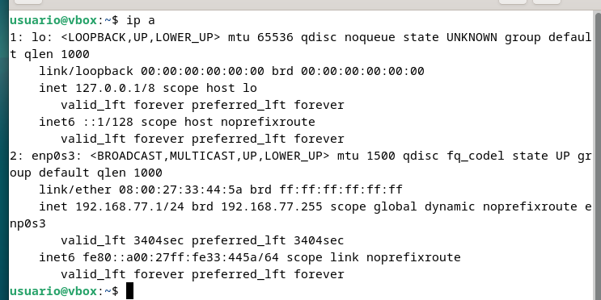
   
3. Una vez obtenida la ip de nuestra máquina, ejecutamos el comando `ssh nuestro_usuario@ip_maquina` y vamos respondiendo lo que nos pide.
   
    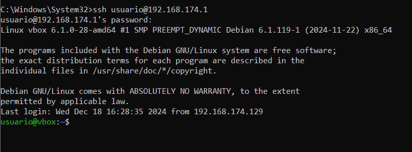

4. La confirmación de que estamos conectados es que nos aparezca en la zona de la ubicación donde nos encontramos, el `usuario@host_maquina`.
   
    

## Instalación de Nginx
Para esta práctica se utilizará un servidor Nginx y para ello tenemos que proceder a su sencilla instalación.

1. Actualizamos la lista de paquetes con el comando `sudo apt update`.
2. Instalamos Nginx con el comando `sudo apt install nginx`.

    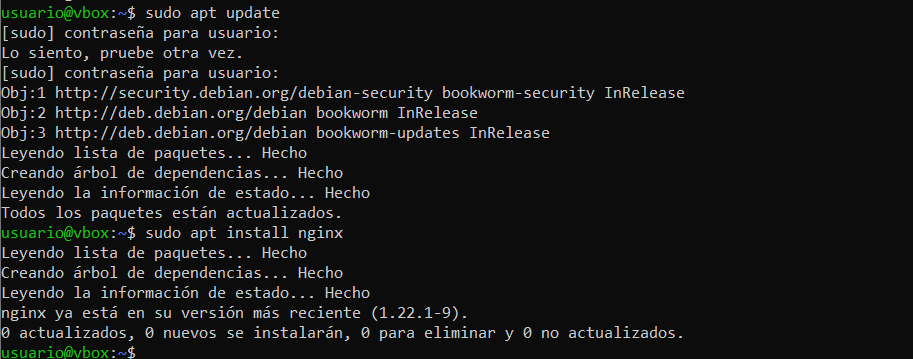

3. Para comprobar que la instalación ha sido exitosa simplemente tenemos que ejecutar el comando `sudo systemctl status nginx` y nos tiene que salir un mensaje parecido a este.

    

## Creación de usuarios
Para esta práctica tendremos que crear dos nuevos usuarios y asignarles una buena contraseña.
### Usuario1
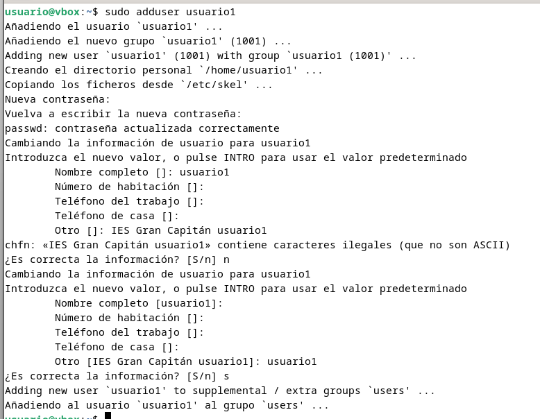

### Usuario2


En el directorio `home` de cada uno de los usuarios tendremos que crear la carpeta `public_html`. Para ello simplemente tenemos que ejecutar el comando `sudo mkdir /home/usuario#/public_html` para cada uno de los usuarios.


### Permisos
Es importante dar los respectivos permisos a las carpetas creadas para que Nginx pueda acceder a ellas sin que la propiedad y los archivos que contienen se pierdan por parte del usuario. Es muy sencillo, sólo hay que ejecutar los siguientes comandos.
  
Damos permiso para que sólo el usuario1 pueda leer, escribir y ejecutar en el directorio y el resto de usuarios y servicios puedan ejecutar solamente.

- `sudo chmod 711 /home/usuario1` 
- `sudo chmod 711 /home/usuario2`

    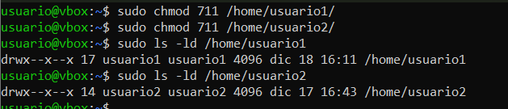

Cambiamos recursivamente el propietario y grupo del directorio /home/usuario1/public_html (y todo su contenido) al usuario y grupo www-data, que es utilizado por servidores web como Nginx o Apache, para que el servidor web pueda leer, escribir o gestionar los archivos de ese directorio. 

Además le damos permisos al propietario para que pueda leer, escribir y ejecutar de forma recursiva en todos los archivos y directorios dentro de la carpeta `public_html` de cada usuario y también permisos de lectura y ejecución al resto de usuarios y grupos.  

- `sudo chown -R www-data:www-data /home/usuario1/public_html`
- `sudo chown -R www-data:www-data /home/usuario2/public_html`
- `sudo chmod -R 755 /home/usuario1/public_html`
- `sudo chmod -R 755 /home/usuario2/public_html`
  
    

### Creación de las páginas web
En la carpeta `public_html` que hemos creado en cada uno de los usuarios, creamos una página web sencilla. En mi caso se tratan de dos web con un `<p>` similar y un `<h1>` indicando cada uno de los usuarios, para posteriormente poder diferenciarlas en cada una de las web.

#### Usuario 1

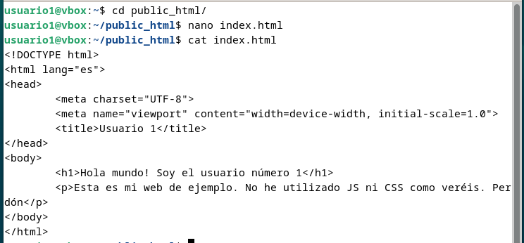

#### Usuario 2


## Hosts virtuales
Creamos los hosts virtuales para cada uno de los usuarios en el directorio `/etc/nginx/sites-available/`. Para poder diferenciarlos le damos el nombre de usuario como nombre del archivo de configuración.

Para la configuración, solamente tenemos que poner este bloque, provocando que ya podamos conectarnos por HTTP a la aplicación web.

```code
server {
    listen 80;
    server_name usuarioN.local;     # En la 'N' va el número de usuario

    root /home/usuarioN/public_html;
    index index.html;

    return 301 https://$server_name$request_uri;

    location / {
        try_files $uri /$uri =404;
    }
}
```

### Usuario 1

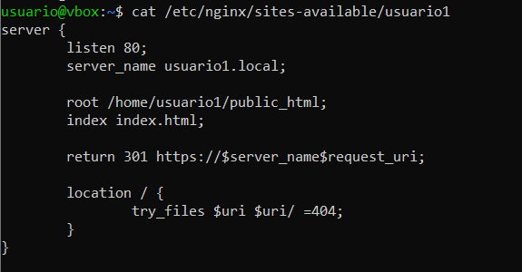

### Usuario 2


### Habilitación de los archivos de configuración
Creamos enlaces simbólicos en `sites-enabled` para habilitar los archivos de configuración. Para ello ejecutamos el comando `sudo ln -s /etc/nginx/sites-available/usuario# /etc/nginx/sites-enabled` donde el # será el número de usuario


Para comprobar si están correctamenet configurados simplemente tenemos que ejecutar el comando `ls -l /etc/nginx/sites-enabled/` y de esta forma nos saldrán los distintos archivos y los permisos que tiene cada uno.


### Reiniciamos nginx
Para que todos estos cambios se puedan ver, debemos reiniciar Nginx. De esta forma actualizará toda la configuración que tiene programada por defecto y aplica. También si hay algun tipo de error, el reinicio fallará y no se iniciará Nginx, lo que hará que nos demos cuenta de si algún archivo de configuración de los que hemos creado, está mal hecho. Para reiniciarlo simplemente debemos ejecutar el comando `sudo systemctl restart nginx.service` y ya, si todo ha sido correctamente editado, se aplicarán los cambios realizados y nos mostrará el siguiente mensaje.

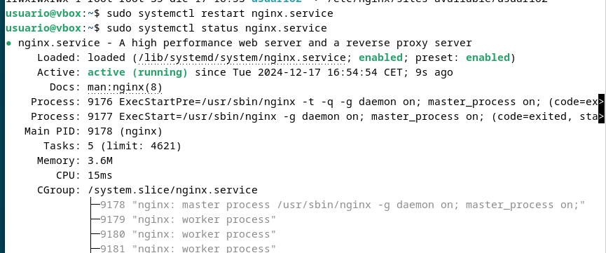

## Configuración archivo `/etc/hosts`
Para que podamos acceder a los sitios web mediante los nombres ficticios de dominio desde nuestra máquina, primero debemos configurar el archivo `/etc/hosts` y adjudicar el dominio que queramos para nuestra web a nuestra ip local. En este paso es importante ponerle el nombre que hemos puesto en la configuración del archivo `/etc/nginx/sites-available/`, en mi caso `usuario#.local`.

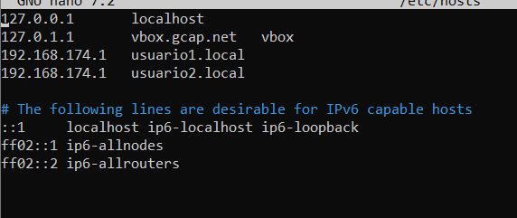

## Resultados http
Una vez hecho todo este proceso ya podemos probar a acceder a las webs:

- [http://usuario1.local](http://usuario1.local)

    
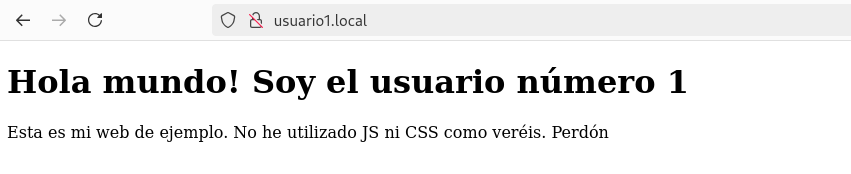

- [http://usuario2.local](http://usuario2.local)
  
    

## HTTPS
### SSL
Para poder crear la configuración para que nos redirija a HTTPS cada vez que tratemos de entrar a la web, primero crearemos una clave SSL que caduque, por ejemplo, dentro de un año y de esta forma hacer que sea necesario autentificarse para tener mayor seguridad.

Para ello ejecutamos el siguiente comando:

```
sudo openssl req -x509 -nodes -days 365 -newkey rsa:2048 -keyout /etc/nginx/ssl/server.key -out /etc/nginx/ssl/server.crt
```

Con este comando lo que conseguimos es generar un certificado SSL autofirmado y su correspondiente clave privada para el servidor de Nginx y lo guarda en rutas expecíficas (`server.key` para la clave privada y `server.crt` para el certificado.).

Despues vamos rellenando los campos que nos pide.
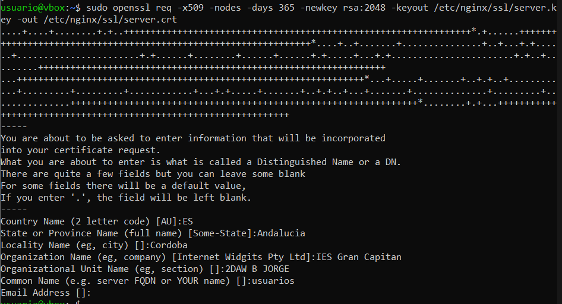

### Puerto 443 ssl
Configuración del puerto 443 ssl en el archivo `/etc/nginx/sites-available/usuarioN`. Para ello simplemente tenemos que añadir el siguiente bloque al documento.

```code
server {
    listen 443 ssl;
    
    ssl_certificate /etc/nginx/ssl/server.crt;
    ssl_certificate_key /etc/nginx/ssl/server.key;

    ssl_protocols TLSv1.3;
    ssl_ciphers ECH+AESGCM:DH+AESGCM:ECDH+AES256:DH+AES256:ECDH+AES128:ECDH+3DES:DH+3DES:RSA+AESGCM:RSA+AES:RSA+3DES:!aNULL:!MD5:!DSS;
    server_name usuarioN.local;
    access_log /var/log/nginx/https_access.log;

    root /home/usuarioN/public_html;
    index index.html;

    location / {
        root /home/usuarioN/public_html;
        index index.html;
    }
}
```

#### Usuario 1

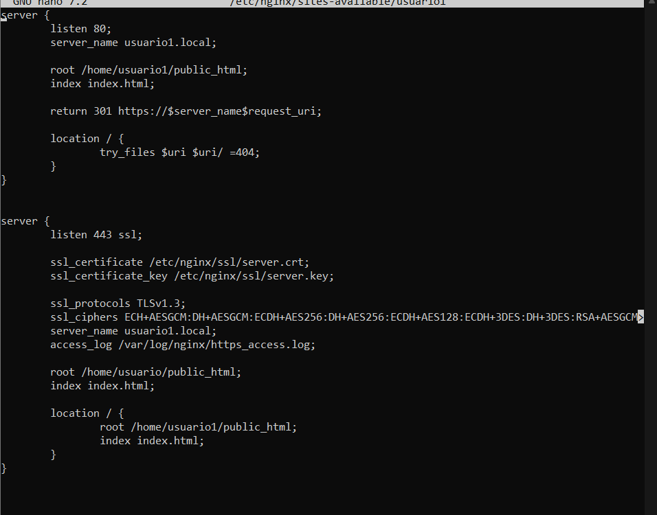

#### Usuario 2


### Resultados HTTPS
Al intentar acceder a [http://usuario1.local](http://usuario1.local) o [http://usuario2.local](http://usuario2.local) lo que pasa es que automáticamente somos redireccionados a la web https de cada una de las aplicaciones con la confiugración que hemos establecido anteriormente. 

#### [http://usuario1.local](http://usuario1.local)
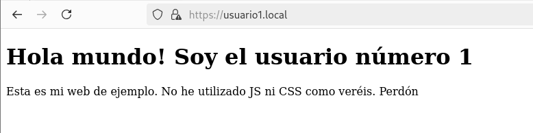

#### [http://usuario2.local](http://usuario2.local)
